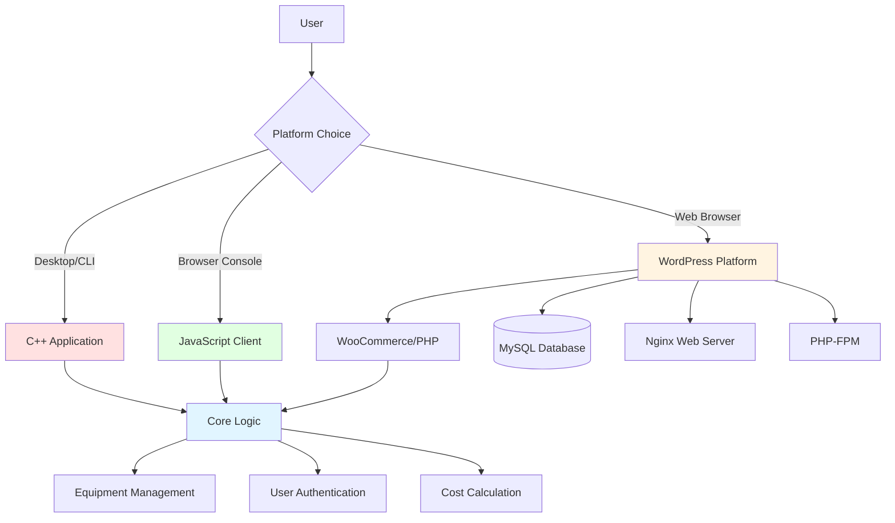

# Habibit

**A peer-to-peer equipment rental platform** connecting lenders who own farming and agricultural equipment with borrowers who need temporary access.

Built to demonstrate multi-platform software development with identical business logic implemented across CLI, web browser, and full-stack web application environments.

---

## Table of Contents

- [Key Features](#-key-features)
- [What This Project Demonstrates](#-what-this-project-demonstrates)
- [Architecture Overview](#-architecture-overview)
- [Quick Start](#-quick-start)
- [Usage](#-usage)
- [Configuration](#-configuration)
- [Testing &amp; Quality](#-testing--quality)
- [Project Status](#-project-status)
- [Contributing](#-contributing)
- [License](#-license)

---

## Key Features

- **User Authentication**: Account creation and sign-in system for both lenders and borrowers
- **Equipment Management**: Lenders can add, list, and manage their equipment inventory
- **Rental Marketplace**: Borrowers can browse available equipment and select items to rent
- **Cost Calculation**: Automatic pricing with daily rates and 2.5% tax calculation
- **Multi-Day Rentals**: Support for flexible rental periods with per-day cost breakdown
- **Three Implementation Platforms**:
  - C++ desktop CLI application ([`Cpp Impelemtation/`](./Cpp%20Impelemtation/))
  - JavaScript browser-based interface ([`Cpp Impelemtation/Javascript implementation/`](./Cpp%20Impelemtation/Javascript%20implementation/))
  - Full WordPress + WooCommerce web platform ([`habifarm/`](./habifarm/))

**Note**: The WordPress implementation includes WooCommerce Multi-Vendor plugin for marketplace functionality.

---

## What This Project Demonstrates

This project showcases professional software engineering practices and domain knowledge:

| Capability                           | Evidence                                                                        | Location                                                                                                                                |
| ------------------------------------ | ------------------------------------------------------------------------------- | --------------------------------------------------------------------------------------------------------------------------------------- |
| **Object-Oriented Design**     | Clean class hierarchy (Equipment, Lender, Borrower) with separation of concerns | [`Habibit.h`](./Cpp%20Impelemtation/Habibit.h), [`Habibit.cpp`](./Cpp%20Impelemtation/Habibit.cpp)                                        |
| **Multi-Platform Development** | Same business logic adapted to CLI, browser, and web stack                      | [`Cpp Impelemtation/`](./Cpp%20Impelemtation/), [`habifarm/`](./habifarm/)                                                                |
| **E-Commerce Integration**     | WordPress + WooCommerce + Multi-Vendor plugin configuration                     | [`habifarm/app/public/wp-content/plugins/`](./habifarm/app/public/wp-content/plugins/)                                                   |
| **Containerization & DevOps**  | Docker-based deployment with Nginx, PHP-FPM, MySQL configuration                | [`habifarm/conf/`](./habifarm/conf/)                                                                                                     |
| **Database Design**            | MySQL integration for persistent data storage                                   | [`habifarm/app/sql/local.sql`](./habifarm/app/sql/local.sql)                                                                             |
| **Web Server Configuration**   | Custom Nginx configs with WordPress optimization                                | [`habifarm/conf/nginx/`](./habifarm/conf/nginx/)                                                                                         |
| **Cost Modeling**              | Tax calculation, multi-day rental pricing logic                                 | [`Habibit.cpp:14-20`](./Cpp%20Impelemtation/Habibit.cpp#L14-L20)                                                                         |
| **Cross-Language Translation** | Identical algorithms in C++ and JavaScript                                      | Compare[`Habibit.cpp`](./Cpp%20Impelemtation/Habibit.cpp) vs [`Habibit.js`](./Cpp%20Impelemtation/Javascript%20implementation/Habibit.js) |

---

## Architecture Overview

Habibit uses a **three-tier implementation strategy** with shared business logic:



### Core Components

**Business Logic Layer** (platform-agnostic):

- **Equipment**: Properties include name, model, daily rental cost
- **Lender**: Manages equipment inventory, adds new items
- **Borrower**: Selects equipment, calculates rental costs with tax

**Platform Implementations**:

1. **C++ CLI** ([`Cpp Impelemtation/`](./Cpp%20Impelemtation/))

   - Compiled executable with console I/O
   - Files: `Habibit.h`, `Habibit.cpp`, `mainFile.cpp`
   - Build: `g++ -std=c++11 -o habibit Habibit.cpp mainFile.cpp`
2. **JavaScript Browser Client** ([`Cpp Impelemtation/Javascript implementation/Habibit.js`](./Cpp%20Impelemtation/Javascript%20implementation/Habibit.js))

   - Browser-compatible with `prompt()` dialogs
   - Same class structure as C++
3. **WordPress Web Platform** ([`habifarm/`](./habifarm/))

   - Full CMS with WooCommerce e-commerce
   - Docker deployment (Nginx + PHP-FPM + MySQL)
   - Multi-vendor marketplace functionality

See [Architecture Documentation](./docs/ARCHITECTURE.md) for detailed system design and data flow diagrams.

---

## Quick Start

### Prerequisites

**For C++ Implementation:**

- C++ compiler with C++11 support (GCC 4.8+, Clang 3.3+, MSVC 2015+)
- Standard library

**For JavaScript Implementation:**

- Modern web browser (Chrome, Firefox, Safari, Edge)

**For WordPress Platform:**

- Docker and Docker Compose (recommended)
  - OR manual stack: PHP 7.4+, MySQL 5.7+, Nginx/Apache
- 512 MB RAM minimum (2 GB recommended)
- 200 MB disk space (minimum)

---

### Installation

#### Option 1: C++ Desktop Application

```bash
# Navigate to C++ implementation directory
cd "Cpp Impelemtation"

# Compile the application
g++ -std=c++11 -o habibit Habibit.cpp mainFile.cpp

# Run the application
./habibit
```

**Windows:**

```cmd
# Compile with MinGW or MSVC
g++ -std=c++11 -o habibit.exe Habibit.cpp mainFile.cpp

# Run
habibit.exe
```

#### Option 2: JavaScript Browser Client

```bash
# Open in browser (no build required)
cd "Cpp Impelemtation/Javascript implementation"
# Open Habibit.js in browser developer console, or include in an HTML file
```

**Example HTML wrapper:**

```html
<!DOCTYPE html>
<html>
<head><title>Habibit</title></head>
<body>
  <h1>Open Console (F12) to interact</h1>
  <script src="Habibit.js"></script>
</body>
</html>
```

#### Option 3: WordPress Platform (Docker)

```bash
# Navigate to habifarm directory
cd habifarm

# Configure environment (see Configuration section)
# Create docker-compose.yml (TODO: needs confirmation - file not present)

# Start services
docker-compose up -d

# Access at http://localhost (or configured port)
```

**Note**: Docker Compose file is not present in the repository. Manual WordPress installation required. See [Development Guide](./docs/DEVELOPMENT.md).

---

### Minimal Example Usage

**C++ CLI:**

```
Main Menu:
1. Create Account
2. Sign In
3. Exit

[Select 1] → Enter username/password
[Select 2] → Sign in
[Select 1] → Lender Menu → Add Equipment
  - Name: Tractor
  - Model: John Deere 5055E
  - Cost per day: $150

[Select 2] → Borrower Menu → Borrow Equipment
  - Select equipment: 1
  - Days to rent: 7
  - Total: $1,078.13 (includes 2.5% tax)
```

---

## Usage

### C++ Application

**Account Management:**

```
1. Create Account
   - Username: farmer_john
   - Password: ********
   
2. Sign In
   - Enter credentials
```

**Lender Workflow:**

```
Lender Menu:
1. Add Equipment
   - Equipment name: Plow
   - Model name: 3-Bottom Moldboard
   - Cost per day: 50
   
2. Display Equipment
   - Lists all available equipment with ID, name, model, price
```

**Borrower Workflow:**

```
Borrower Menu:
1. Borrow Equipment
   - Select equipment by number
   - Enter multiple selections (0 to finish)
   - Enter rental days
   - Review calculated cost
   
2. Checkout
   - Confirm selection
   - See total with tax
   - Rental confirmed with 5-day delivery
```

### JavaScript Browser Client

Same workflow as C++ but uses browser `prompt()` dialogs:

```javascript
// Open browser console and run:
// The script will prompt for inputs via dialog boxes
```

### WordPress Platform

**Admin Access:**

```
URL: http://localhost/wp-admin
Username: (configured during installation)
Password: (configured during installation)
```

**Managing Equipment:**

- Navigate to WooCommerce → Products
- Add new product as equipment listing
- Set daily rental price
- Manage vendor roles via Multi-Vendor plugin

**Borrower Experience:**

- Browse equipment catalog
- Add to cart
- Checkout with WooCommerce
- (Tax calculation matches CLI: 2.5%)

---

## Configuration

### WordPress Environment Variables

Create `.env` file in `habifarm/` directory:

| Variable         | Description            | Default       | Required |
| ---------------- | ---------------------- | ------------- | -------- |
| `DB_NAME`      | MySQL database name    | `local`     | Yes      |
| `DB_USER`      | Database username      | `root`      | Yes      |
| `DB_PASSWORD`  | Database password      | `root`      | Yes      |
| `DB_HOST`      | Database hostname      | `localhost` | Yes      |
| `DB_CHARSET`   | Database character set | `utf8`      | No       |
| `TABLE_PREFIX` | WordPress table prefix | `wp_`       | No       |

**Example** (see [`.env.example`](./.env.example)):

```bash
DB_NAME=habibit_db
DB_USER=habibit_user
DB_PASSWORD=secure_password_here
DB_HOST=mysql
DB_CHARSET=utf8mb4
TABLE_PREFIX=hb_
```

### WordPress Configuration

Edit `habifarm/app/public/wp-config.php` with database credentials. Use [WordPress Secret Key Generator](https://api.wordpress.org/secret-key/1.1/salt/) for security keys.

**Current configuration** (development only - tracked in repository):

```php
define('DB_NAME', 'local');
define('DB_USER', 'root');
define('DB_PASSWORD', 'root');
define('DB_HOST', 'localhost');
```

⚠️ **Security Warning**:

- The repository includes `wp-config.php` with **development credentials** for easy local setup
- **NEVER use these credentials in production**
- Update all database credentials and regenerate security keys before any public deployment
- See [SECURITY.md](./SECURITY.md) for complete deployment checklist

### C++ / JavaScript Configuration

No configuration files required. All data stored in-memory during runtime.

---

## Testing & Quality

### C++ Application

**Compile and test:**

```bash
cd "Cpp Impelemtation"

# Build with warnings enabled
g++ -std=c++11 -Wall -Wextra -o habibit Habibit.cpp mainFile.cpp

# Verify build
./habibit --version  # (Not implemented - runs main menu)

# Manual testing workflow
./habibit
# Follow prompts to test account creation, equipment listing, rental flow
```

**Known limitations:**

- No unit tests present
- No automated testing framework
- Input validation is basic

### JavaScript Application

**Browser console testing:**

```javascript
// Load Habibit.js in console
// Test class instantiation:
const lender = new Lender();
const equipment = new Equipment("Tractor", "JD 5055E", 150);
lender.addEquipment(equipment);
console.log(lender.equipmentList);  // Verify equipment added
```

### WordPress Platform

**Manual testing checklist:**

- [ ] WordPress admin login
- [ ] WooCommerce product creation
- [ ] Multi-vendor functionality
- [ ] Cart and checkout flow
- [ ] Database connectivity
- [ ] Nginx serving static files

**Database verification:**

```bash
# Connect to MySQL
mysql -u root -p local

# Check tables
SHOW TABLES LIKE 'wp_%';

# Verify sample data (if present)
SELECT * FROM wp_posts WHERE post_type = 'product';
```

---

## Project Status

**Current State**: Educational/proof-of-concept implementation

**Completed Features:**

- ✅ C++ CLI application with full rental workflow
- ✅ JavaScript browser implementation
- ✅ WordPress installation with WooCommerce
- ✅ Multi-vendor plugin integration
- ✅ Cost calculation with tax
- ✅ Basic account system
- ✅ Equipment listing and selection

**Known Limitations:**

- No payment processing integration (placeholder in checkout)
- No persistent data storage in CLI/JS versions (in-memory only)
- No password hashing/encryption in CLI version
- Docker Compose configuration not included
- No automated tests
- No API endpoints for cross-platform integration

**Future Enhancements** (TODO - needs confirmation from maintainer):

- [ ] RESTful API for equipment management
- [ ] Payment gateway integration (Stripe/PayPal)
- [ ] Real-time availability tracking
- [ ] Rating and review system
- [ ] Mobile application
- [ ] Equipment insurance options
- [ ] Delivery/pickup scheduling

---

## Contributing

Contributions are welcome! Please see [CONTRIBUTING.md](./CONTRIBUTING.md) for guidelines.

**Quick contribution guide:**

1. Fork the repository
2. Create a feature branch (`git checkout -b feature/amazing-feature`)
3. Make your changes
4. Test thoroughly (C++ compile, JS browser test, WordPress if applicable)
5. Commit with clear messages (`git commit -m 'Add amazing feature'`)
6. Push to your fork (`git push origin feature/amazing-feature`)
7. Open a Pull Request

**Areas needing help:**

- Unit tests for C++ classes
- Docker Compose configuration for habifarm
- API development for cross-platform integration
- Payment gateway integration
- Mobile app development

---

## License

This project is licensed under the **GNU General Public License v3.0** (GPL-3.0).

See [LICENSE](./LICENSE) file for full terms.

**Key Points:**

- Free to use, modify, and distribute
- Modified versions must also be GPL-3.0
- No warranty provided
- Source code must be made available

**Third-Party Licenses:**

- WordPress: GPL-2.0-or-later
- WooCommerce: GPL-3.0
- Multi-Vendor Plugin: Check plugin documentation
- Elementor: GPL-3.0

---

## Credits & Acknowledgements

**Project Assets:**

- Logo design: [`Habifarm Logo Design/`](./Habifarm%20Logo%20Design/)
- Site media (images/video): [`Site Media/`](./Site%20Media/)
  - Farming photos from Unsplash (Chris Robert, Julia Koblitz, Randy Fath)
  - Video from Pexels (Jannis Knorr)

**Technologies:**

- [WordPress](https://wordpress.org/) - Content Management System
- [WooCommerce](https://woocommerce.com/) - E-commerce platform
- [Multi-Vendor Marketplace Plugin](https://multivendorx.com/) - Vendor management

**Development Tools:**

- GCC/G++ - C++ compilation
- Docker - Containerization
- Nginx - Web server
- MySQL - Database

---

## Support

**Issues & Questions:**

- Report bugs via [GitHub Issues](https://github.com/jakujobi/Habibit/issues)
- For security concerns, see [SECURITY.md](./SECURITY.md)

**Documentation:**

- [Architecture Guide](./docs/ARCHITECTURE.md)
- [Development Setup](./docs/DEVELOPMENT.md)
- [Contributing Guidelines](./CONTRIBUTING.md)

---

**Built with ❤️ for the agricultural community**
