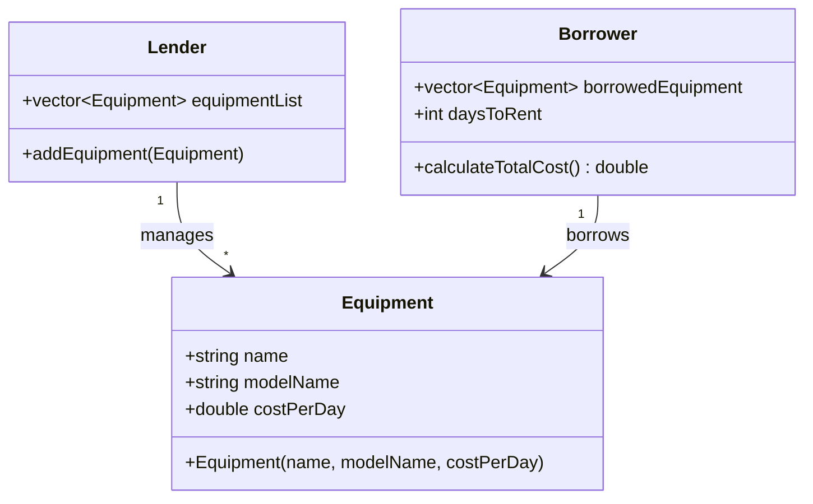
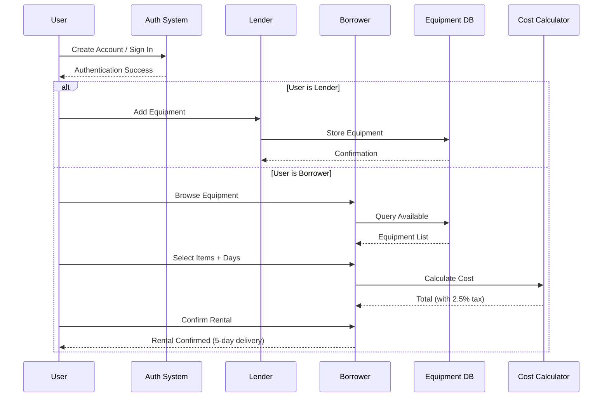
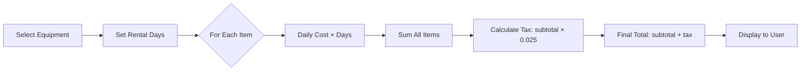

# Habibit Architecture

Comprehensive system design documentation for the Habibit equipment rental platform.

---

## Table of Contents

- [System Overview](#system-overview)
- [Design Philosophy](#design-philosophy)
- [Core Domain Model](#core-domain-model)
- [Platform Implementations](#platform-implementations)
- [Data Flow](#data-flow)
- [WordPress Platform Details](#wordpress-platform-details)
- [Security Architecture](#security-architecture)
- [Deployment Architecture](#deployment-architecture)

---

## System Overview

Habibit is a **peer-to-peer equipment rental marketplace** that demonstrates the same business logic across three different technology stacks:

```
┌─────────────────────────────────────────────────────────────┐
│                      Habibit Platform                        │
├──────────────┬──────────────────┬──────────────────────────┤
│   C++ CLI    │  JavaScript      │   WordPress + WooCommerce │
│  (Desktop)   │  (Browser)       │   (Full Web Stack)        │
└──────────────┴──────────────────┴──────────────────────────┘
        │              │                      │
        └──────────────┴──────────────────────┘
                       │
          ┌────────────▼────────────┐
          │   Core Business Logic   │
          │  - Equipment Management │
          │  - User Authentication  │
          │  - Cost Calculation     │
          └─────────────────────────┘
```

**Architecture Pattern**: Multi-platform implementation with shared domain logic

---

## Design Philosophy

### Principles

1. **Platform-Agnostic Logic**: Core rental business rules are identical across all implementations
2. **Separation of Concerns**: UI/UX layer is separate from business logic
3. **Progressive Enhancement**: From simple CLI → browser → full web application
4. **Educational Value**: Demonstrates same algorithm in different languages/frameworks

### Technology Choices

| Layer | C++ | JavaScript | WordPress |
|-------|-----|------------|-----------|
| **Language** | C++11 | ES5+ | PHP 7.4+ |
| **Storage** | In-memory (vectors) | In-memory (arrays) | MySQL database |
| **UI** | Console I/O | Browser prompts | Web interface |
| **State** | Session-based | Session-based | Persistent |
| **Deployment** | Compiled binary | Static file | Docker containers |

---

## Core Domain Model

### Class Diagram



### Entity Definitions

#### Equipment
**Purpose**: Represents a single piece of rentable equipment

**Properties**:
- `name` (string): Equipment type (e.g., "Tractor", "Plow")
- `modelName` (string): Specific model identifier (e.g., "John Deere 5055E")
- `costPerDay` (double): Daily rental rate in USD

**Invariants**:
- Cost must be non-negative
- Name and model cannot be empty

**File Locations**:
- C++: [`Habibit.h:9-16`](../Cpp%20Implementation/Habibit.h#L9-L16)
- JavaScript: [`Habibit.js:1-7`](../Cpp%20Implementation/Javascript%20implementation/Habibit.js#L1-L7)

#### Lender
**Purpose**: Manages inventory of equipment available for rent

**Properties**:
- `equipmentList` (vector/array): Collection of Equipment objects

**Methods**:
- `addEquipment(equipment)`: Adds new equipment to inventory

**File Locations**:
- C++: [`Habibit.h:18-23`](../Cpp%20Implementation/Habibit.h#L18-L23)
- JavaScript: [`Habibit.js:9-17`](../Cpp%20Implementation/Javascript%20implementation/Habibit.js#L9-L17)

#### Borrower
**Purpose**: Manages rental transactions for a user borrowing equipment

**Properties**:
- `borrowedEquipment` (vector/array): Items currently selected for rental
- `daysToRent` (integer): Duration of rental period

**Methods**:
- `calculateTotalCost()`: Computes total with 2.5% tax

**Formula**:
```
subtotal = Σ(equipment.costPerDay × daysToRent)
tax = subtotal × 0.025
total = subtotal + tax
```

**File Locations**:
- C++: [`Habibit.h:27-31`](../Cpp%20Implementation/Habibit.h#L27-L31), [`Habibit.cpp:13-20`](../Cpp%20Implementation/Habibit.cpp#L13-L20)
- JavaScript: [`Habibit.js:19-32`](../Cpp%20Implementation/Javascript%20implementation/Habibit.js#L19-L32)

---

## Platform Implementations

### 1. C++ CLI Application

**Files**:
- `Habibit.h` - Class definitions
- `Habibit.cpp` - Class implementations
- `mainFile.cpp` - Entry point and UI logic
- `Habibit Main.cpp` - Alternative combined implementation

**Architecture**:
```
┌─────────────────────────────────┐
│        Main Entry Point         │
│       (mainFile.cpp)            │
└────────────┬────────────────────┘
             │
    ┌────────▼────────┐
    │  Console I/O    │
    │  (cin/cout)     │
    └────────┬────────┘
             │
    ┌────────▼────────────────┐
    │   Business Logic        │
    │   Habibit.cpp/.h        │
    └────────┬────────────────┘
             │
    ┌────────▼────────┐
    │   STL Vectors   │
    │  (in-memory)    │
    └─────────────────┘
```

**Build Process**:
```bash
g++ -std=c++11 -o habibit Habibit.cpp mainFile.cpp
```

**Dependencies**: C++ Standard Library (no external dependencies)

**Storage**: In-memory vectors (data lost on exit)

### 2. JavaScript Browser Client

**Files**:
- `Habibit.js` - Complete implementation (classes + UI)

**Architecture**:
```
┌─────────────────────────────────┐
│       Browser Runtime           │
└────────────┬────────────────────┘
             │
    ┌────────▼────────┐
    │  prompt() I/O   │
    │  Dialog Boxes   │
    └────────┬────────┘
             │
    ┌────────▼────────────────┐
    │   ES5+ Classes          │
    │   (Habibit.js)          │
    └────────┬────────────────┘
             │
    ┌────────▼────────┐
    │   JavaScript    │
    │   Arrays        │
    │  (in-memory)    │
    └─────────────────┘
```

**Execution**: Load in browser console or include in HTML `<script>` tag

**Dependencies**: None (vanilla JavaScript)

**Storage**: In-memory arrays (data lost on refresh)

### 3. WordPress + WooCommerce Platform

**Directory Structure**:
```
habifarm/
├── app/
│   ├── public/          # WordPress installation root
│   │   ├── wp-admin/
│   │   ├── wp-content/
│   │   │   ├── plugins/
│   │   │   │   ├── dc-woocommerce-multi-vendor/
│   │   │   │   ├── elementor/
│   │   │   │   └── woocommerce/
│   │   │   └── themes/
│   │   └── wp-config.php
│   └── sql/
│       └── local.sql    # Database dump
├── conf/                # Docker configurations
│   ├── mysql/
│   ├── nginx/
│   └── php/
└── logs/
```

**Architecture**:
```
┌─────────────────────────────────────────────┐
│              User Browser                    │
└──────────────┬──────────────────────────────┘
               │ HTTP/HTTPS
    ┌──────────▼──────────┐
    │   Nginx (Port 80)   │
    │   Static + Proxy    │
    └──────────┬──────────┘
               │
    ┌──────────▼──────────┐
    │   PHP-FPM 7.4+      │
    │   WordPress Core    │
    └──────────┬──────────┘
               │
    ┌──────────▼──────────────────┐
    │   WooCommerce Plugin        │
    │   + Multi-Vendor Extension  │
    └──────────┬──────────────────┘
               │
    ┌──────────▼──────────┐
    │   MySQL 5.7/8.0     │
    │   Persistent Data   │
    └─────────────────────┘
```

**Key Plugins**:
1. **WooCommerce**: E-commerce framework
   - Product management (equipment listings)
   - Cart and checkout
   - Order processing

2. **Multi-Vendor Marketplace**: 
   - Vendor registration (lenders)
   - Product assignment to vendors
   - Commission/earnings tracking

3. **Elementor**: Page builder for custom layouts

4. **Ajax Search**: Equipment discovery

**Data Mapping**:
| Domain Concept | WordPress/WooCommerce Implementation |
|----------------|--------------------------------------|
| Equipment | WooCommerce Product (type: simple or rental) |
| Lender | Vendor (Multi-Vendor role) |
| Borrower | Customer (WooCommerce role) |
| Daily Cost | Product Price (per day) |
| Rental Duration | Custom product meta field |
| Tax (2.5%) | WooCommerce Tax Rate |

---

## Data Flow

### Rental Workflow (All Platforms)



### Cost Calculation Flow



**Implementation** (C++):
```cpp
double Borrower::calculateTotalCost() const {
    double totalCost = 0.0;
    for (const Equipment& equipment : borrowedEquipment) {
        totalCost += equipment.costPerDay;  // Note: multiply by daysToRent in UI
    }
    return totalCost + (totalCost * 0.025); // 2.5% tax
}
```

---

## WordPress Platform Details

### Database Schema (Simplified)

**Key Tables**:
```sql
wp_posts              -- Equipment (post_type = 'product')
├── ID                -- Product ID
├── post_title        -- Equipment name
├── post_content      -- Description
└── post_status       -- published/draft

wp_postmeta           -- Product metadata
├── meta_key          -- '_price' (daily cost)
├── meta_value        -- Cost value
└── post_id           -- FK to wp_posts

wp_users              -- Lenders & Borrowers
├── ID
├── user_login        -- Username
└── user_email

wp_woocommerce_order_items  -- Rentals
└── order_id          -- FK to wp_posts (post_type = 'shop_order')
```

### Plugin Integration Points

**WooCommerce Hooks** (potential customization):
- `woocommerce_add_to_cart`: Capture rental duration
- `woocommerce_calculate_totals`: Apply 2.5% tax
- `woocommerce_order_status_completed`: Trigger delivery (5-day promise)

**Multi-Vendor Hooks**:
- Vendor dashboard customization
- Commission calculation
- Payout management

---

## Security Architecture

### Threat Model

| Asset | Threat | Mitigation (C++/JS) | Mitigation (WordPress) |
|-------|--------|---------------------|------------------------|
| User Passwords | Plain text storage | ⚠️ None - educational only | bcrypt hashing via WordPress |
| Equipment Data | Unauthorized modification | In-memory only (session) | Role-based access control |
| Rental Transactions | Price manipulation | Fixed calculation logic | Server-side validation |
| Database | SQL injection | N/A | WordPress escaping functions |

⚠️ **Security Warning**: C++ and JavaScript implementations store passwords in plain text. **Not suitable for production use**.

### WordPress Security

**Authentication**:
- WordPress core user authentication
- Session management via cookies
- Password hashing (bcrypt)

**Authorization**:
- Role-based permissions (Administrator, Vendor, Customer)
- Capability checks for actions

**Data Protection**:
- Prepared statements for SQL queries
- Input sanitization via WordPress functions
- Output escaping

**File Locations**:
- Security keys: `wp-config.php` (use [generator](https://api.wordpress.org/secret-key/1.1/salt/))

---

## Deployment Architecture

### Local Development (WordPress)

```
┌─────────────────────────────────────┐
│      Developer Machine              │
│  ┌────────────────────────────┐    │
│  │  habifarm/app/public/      │    │
│  │  (WordPress files)          │    │
│  └────────────────────────────┘    │
│  ┌────────────────────────────┐    │
│  │  Local MySQL               │    │
│  │  DB: local                 │    │
│  │  User: root / Pass: root   │    │
│  └────────────────────────────┘    │
│  ┌────────────────────────────┐    │
│  │  PHP Built-in Server       │    │
│  │  OR XAMPP/MAMP/Local       │    │
│  └────────────────────────────┘    │
└─────────────────────────────────────┘
```

### Docker Deployment (Planned)

**TODO**: Docker Compose file not present. Expected structure:

```yaml
services:
  nginx:
    image: nginx:alpine
    volumes:
      - ./conf/nginx:/etc/nginx
      - ./app/public:/var/www/html
    ports:
      - "80:80"
  
  php:
    image: php:7.4-fpm
    volumes:
      - ./app/public:/var/www/html
      - ./conf/php:/usr/local/etc/php
  
  mysql:
    image: mysql:8.0
    environment:
      MYSQL_DATABASE: local
      MYSQL_ROOT_PASSWORD: root
    volumes:
      - ./app/sql:/docker-entrypoint-initdb.d
```

**Configuration Files**:
- Nginx: `habifarm/conf/nginx/*.conf.hbs`
- PHP-FPM: `habifarm/conf/php/php.ini.hbs`
- MySQL: `habifarm/conf/mysql/my.cnf.hbs`

**Note**: `.hbs` extension suggests Handlebars templates. May require pre-processing.

---

## Performance Considerations

### C++ Application
- **Memory**: O(n) where n = number of equipment items
- **Startup**: <100ms
- **Scalability**: Limited by RAM

### JavaScript Application
- **Memory**: O(n) JavaScript objects
- **Performance**: Synchronous prompts block UI
- **Scalability**: Browser heap limits (~1-2GB)

### WordPress Platform
- **Database**: Indexed queries for product search
- **Caching**: WordPress object cache, opcache for PHP
- **Bottlenecks**: 
  - MySQL queries (optimize with indexes)
  - PHP execution time (increase `max_execution_time`)
  - Concurrent users (scale horizontally with load balancer)

---

## Future Architecture Considerations

**Potential Enhancements**:

1. **RESTful API Layer**:
   - Decouple frontend from backend
   - Enable mobile app development
   - Unify C++/JS/WordPress with common API

2. **Microservices**:
   - Equipment Service
   - User Service
   - Rental/Booking Service
   - Payment Service

3. **Real-time Features**:
   - WebSocket for availability updates
   - Live chat support

4. **Data Analytics**:
   - Equipment utilization tracking
   - Revenue reporting
   - Demand forecasting

---

## References

- C++ Implementation: [`Cpp Implementation/`](../Cpp%20Implementation/)
- JavaScript Implementation: [`Cpp Implementation/Javascript implementation/`](../Cpp%20Implementation/Javascript%20implementation/)
- WordPress Platform: [`habifarm/`](../habifarm/)
- [Development Guide](./DEVELOPMENT.md)
- [Contributing Guidelines](../CONTRIBUTING.md)
